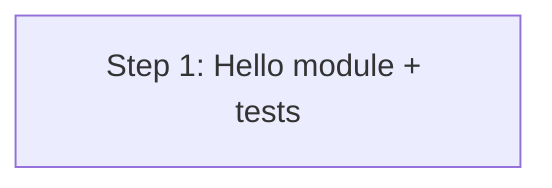

# Implementation Plan: Hello Module

## Dependency Graph

## Checklist
- [x] Step 1: Implement hello module with tests

---

## Step 1: Implement hello module with tests

**Depends on**: none

**Objective**: Create the `hello` module and its unit tests in a single step, since the module is trivially small and the tests are tightly coupled to it.

**Related Files**:
- `src/hello.py` (create) — the hello function
- `tests/test_hello.py` (create) — unit tests
- `pyproject.toml` (read) — check for test runner config

**Test Requirements** (TDD — write tests first):
- Test `hello("World")` returns `"Hello, World!"`
- Test `hello("")` returns `"Hello, !"`
- Test `hello("Alice")` returns `"Hello, Alice!"`

All three test cases from design.md's Integration Testing section are covered here.

**Implementation Guidance**:
- Create `src/hello.py` with the `hello(name: str) -> str` function per design.md Components & Interfaces
- Create `tests/test_hello.py` importing from `src.hello` and testing all cases above
- No external dependencies, no error handling
- Run tests with `pytest` to verify
