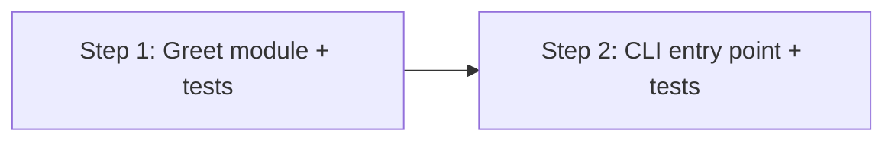

# Implementation Plan: Greet Module

## Dependency Graph

## Checklist
- [x] Step 1: Greet function with unit tests
- [x] Step 2: CLI entry point with subprocess tests

---

## Step 1: Greet function with unit tests

**Depends on**: none

**Objective**: Create the core `greet()` function and verify it with unit tests. This establishes the library interface that the CLI will use.

**Test Requirements**:
- `test_greet_returns_hello_name`: `greet("Alice")` returns `"Hello, Alice!"`
- `test_greet_empty_string`: `greet("")` returns `"Hello, !"`
- `test_greet_special_characters`: `greet("O'Brien")` returns `"Hello, O'Brien!"`

**Implementation Guidance**:
- Create `src/greet.py` with `greet(name: str) -> str` as defined in design.md § Components & Interfaces
- Create `tests/test_greet.py` with the test cases above
- Ensure `src/` and `tests/` directories exist (create if needed)

---

## Step 2: CLI entry point with subprocess tests

**Depends on**: Step 1

**Objective**: Add the `main()` CLI entry point and verify CLI behavior via subprocess calls.

**Test Requirements**:
- `test_cli_prints_greeting`: Running `python src/greet.py Alice` prints `"Hello, Alice!\n"` to stdout
- `test_cli_missing_arg_exits_1`: Running `python src/greet.py` (no args) exits with code 1 and prints usage to stderr
- `test_cli_extra_args_ignored`: Running `python src/greet.py Alice Bob` prints `"Hello, Alice!\n"` (extra args ignored)

**Implementation Guidance**:
- Add `main()` function and `if __name__ == "__main__"` block to `src/greet.py` as defined in design.md § Components & Interfaces
- Add subprocess-based CLI tests to `tests/test_greet.py`
- Follow error handling behavior from design.md § Error Handling
